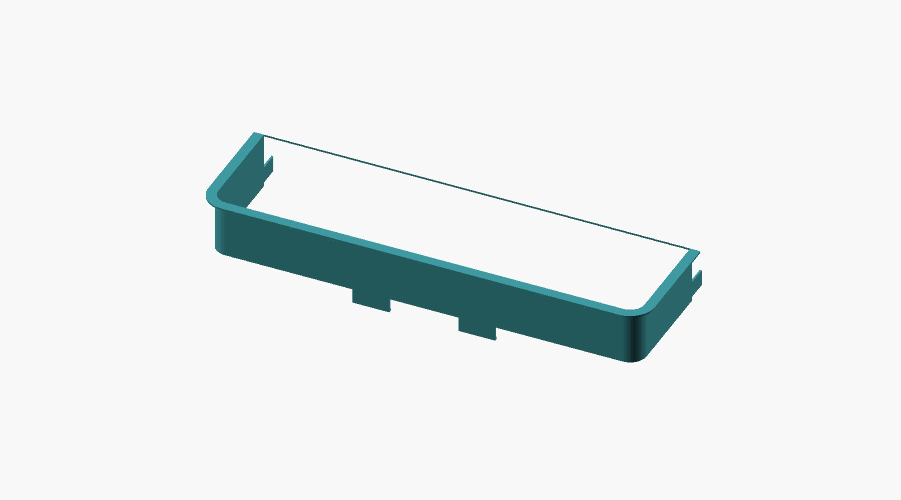

# Samsung DA97-11500A door-bin guard — 3D-printable replacement

Parametric OpenSCAD model and ready-to-slice STLs for the clear U-shaped
fence ("Assy Guard-Ref Bottle", Samsung part **DA97-11500A**) that keeps
condiments in the fresh-food door bins of the RSG307AARS / RSG309 side-by-side.



## Short answer

Yes, this part can be printed. The body is a simple U-shaped wall with a
flared rim, which prints well. Everything that matters for fit is in the
three mounting features — the two snap tabs under the front rail and the
tongue at the end of each leg — and those are exactly the features that
are broken off the sample in the photos, so their dimensions could **not**
be taken from the pictures. The model has them as parameters with
placeholder values. **Print the tab test coupon first**, check it in the
door, adjust, then print the big pieces.

## What is in this folder

| File | What it is |
|---|---|
| `bin_guard.scad` | The parametric source. Every dimension is a named variable at the top. |
| `stl/bin_guard_full.stl` | One-piece part, 548 × 175 × 88 mm. Needs a large-format bed (≥ 550 mm in X). |
| `stl/bin_guard_split_left.stl`, `_middle.stl`, `_right.stl` | Same part cut into three pieces with dovetail joints. Largest footprint 196 × 175 mm — fits a 220 × 220 bed (Ender-3 class) and anything larger. |
| `stl/tab_test_coupon.stl` | 65 mm slice of rail with one snap tab and two short legs with tongues. Print this first to verify the fit. |
| `preview/*.png` | Renders of the model. |

## Dimensions and where they came from

Measured = scaled from the tape-measure photos, accuracy about ±3 mm (±1/8 in).
Assumed = chosen for print strength or not visible in the photos.

| Parameter | Default | Basis |
|---|---|---|
| `width` (rail outer width) | 528 mm (20-13/16 in) | measured, photo with tape along the rail |
| `leg` (rail outer face to leg end) | 140 mm (5-1/2 in) | measured |
| `height` (wall height) | 70 mm (2-3/4 in) | measured, side-view photo |
| `corner` (front corner radius, plan view) | 20 mm | measured |
| `lip` (outward rim width along the top) | 10 mm | measured; the original rim is a rolled bead, modeled here as a flat flange |
| `wall`, `lip_thk` | 2.4 mm | assumed; the original is ~2 mm. 2.4 mm = six 0.4 mm perimeters, noticeably stiffer than the OEM part |
| `tab_w`, `tab_h` | 45 × 18 mm | measured from the two tab stubs on the rail |
| `tab_spacing` (centre to centre) | 130 mm (5-1/8 in) | measured |
| `tab_nub`, `tab_nub_h` (snap ridge on the tab) | 1.5 × 3 mm | **assumed**. The stubs show the ridge is gone; measure the lip it snaps over. |
| `tongue_len`, `tongue_h`, `tongue_z`, `tongue_thk` | 25 × 20 mm, 5 mm up, 2.4 mm thick | **assumed**. Both tongues are broken off. Measure the slots in the door liner. |

## Before printing the full part — measurement checklist

Take these off the door liner and the one remaining good guard (if any of the
three still has its tabs), then edit the variables at the top of `bin_guard.scad`:

1. **Rail width.** Inside width of the door-liner pocket the guard sits in, minus
   about 1 mm total clearance. Confirms `width`.
2. **Wall height.** Confirms `height`. If the original is taller than 70 mm, raise it.
3. **Door-liner slots for the tongues.** Slot depth → `tongue_len`, slot height →
   `tongue_h`, slot width → `tongue_thk` (subtract 0.2 mm for clearance), and how
   far the slot bottom sits above the guard's bottom edge → `tongue_z`.
4. **What the front tabs snap onto.** Thickness of the bin lip or liner rail the
   tabs hook under → `tab_nub` (ridge depth) and `tab_h`.
5. **Rim profile.** The OEM rim is a rounded bead about 10 mm wide. If you want the
   printed rim to match the bead shape, say so and it can be modeled; a flat
   flange is stronger and prints without support.

Then render the coupon and test-fit:

```sh
openscad -o stl/tab_test_coupon.stl -D 'part="coupon"' bin_guard.scad
```

Or override values on the command line without editing the file:

```sh
openscad -o stl/tab_test_coupon.stl -D 'part="coupon"' -D tongue_len=30 -D tongue_h=18 bin_guard.scad
```

Regenerate all pieces after the coupon fits:

```sh
for p in full left middle right coupon; do
  case $p in full) f=bin_guard_full;; coupon) f=tab_test_coupon;; *) f=bin_guard_split_$p;; esac
  openscad -o stl/$f.stl -D "part=\"$p\"" bin_guard.scad
done
```

## Print settings

* **Material: PETG** (first choice) or ASA. Both stay tough at fridge temperature and
  survive the repeated flexing that the snap tabs see. Avoid PLA — it goes brittle
  when cold and the tabs will break the same way the originals did. Clear or
  natural PETG gives a look close to the OEM part.
* **Orientation: rim down.** Place the part upside down so the 10 mm rim lies flat
  on the bed. The tabs and tongues then point up or sideways and nothing needs
  support. Layer lines run horizontally along the rail, which is the strong
  direction for a long rail under bending.
* 0.2 mm layers, 0.4 mm nozzle, 6 perimeters (the walls are 2.4 mm so they print as
  solid perimeters), 4 top/bottom layers, infill irrelevant.
* Brim of 5 to 8 mm on the long pieces; a 528 mm PETG part will warp without it.
* Slow the first layer and use a bed at 80 °C for PETG.

## Assembling the three-piece version

The pieces join with dovetails in the rail wall (0.2 mm clearance). Dry-fit
first; if the joint is tight, sand the tail lightly or re-render with
`-D clearance=0.3`. Glue with a PETG-compatible adhesive (CA with activator,
or a two-part epoxy) and clamp straight along a table edge while it cures.
The joint sits in the plain rail, away from the tabs, so glue strength is not
what holds the guard to the door.


## Two things to double-check

1. **The appliance label in the first photo is a Whirlpool WRF736SDAM11
   (French-door), not a Samsung.** The part number DA97-11500A is a Samsung part
   and the measured 528 mm width fits a Samsung side-by-side fresh-food door. If
   the broken guards actually come out of the Whirlpool, the part number and
   compatible replacement are different, and the Whirlpool door bins are one-piece
   bins rather than a separate guard.
2. **Retail listings describe DA97-11500A as roughly 15-1/2 in wide.** The rail in
   the photo measures about 20-13/16 in. Either the listing describes a different
   sub-assembly or the part in the photo is not DA97-11500A. Measure the door pocket
   before printing; the `width` parameter handles either case.

## OEM price check (September 2026)

Retail listings put the OEM part in the same range you quoted, e.g. $81.25 at
[FiltersFast](https://www.filtersfast.com/p-samsung-da97-11500a-refrigerator-accessory.asp).
Other sellers: [PartSelect](https://www.partselect.com/PS4176345-Samsung-DA97-11500A-Door-Bin.htm?ModelNum=RSG307AARS&ModelID=7099303),
[Sears PartsDirect](https://www.searspartsdirect.com/product/35rk9kjz6r-0046-401/id-da97-11500a),
[Samsung Parts USA](https://samsungpartsusa.com/products/da97-11500a),
[eBay](https://www.ebay.com/itm/387086406652).
Printed cost is roughly 160 cm³ of PETG per guard, about 190 g, or $5 to $8 of
filament each.
